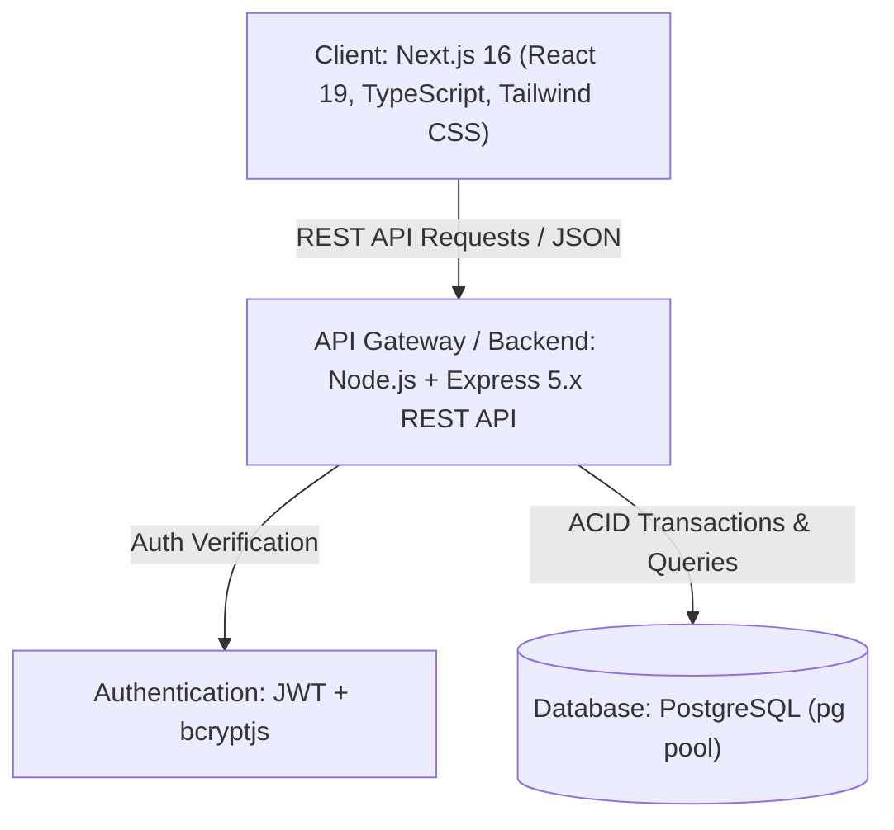
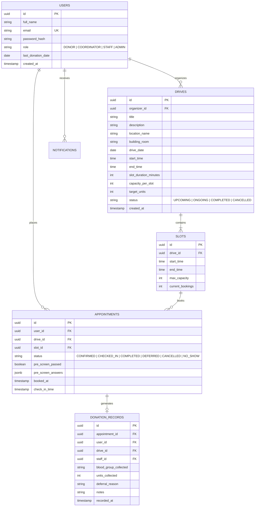
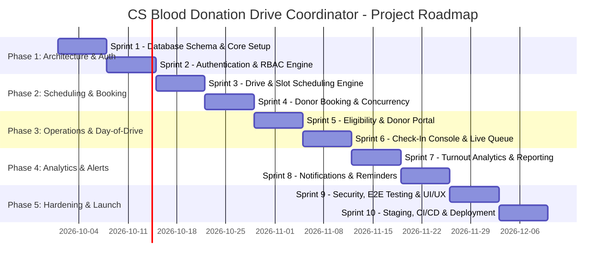

# Project Contract & Master Development Charter
## Campus Blood Donation Drive Coordinator System

---

**Project Name:** CS Blood Donation Drive Coordinator  
**Project Lead / Author:** Nkululeko Ndlwana (*LaxinGroup*)  
**Version:** 1.0.0  
**Status:** Approved Baseline  
**Document Purpose:** This document serves as the binding project contract, defining the problem scope, functional specifications, technical architecture, database design, and the phased sprint roadmap for end-to-end execution.

---

## 1. Executive Summary & Problem Definition

### 1.1 The Problem
Blood donation drives held in university campuses, colleges, and local communities currently rely heavily on manual, paper-based workflows (clipboards, physical sign-up sheets, and in-person queueing). This approach suffers from critical operational bottlenecks:
1. **Double-Booking & Scheduling Chaos:** Lack of real-time slot synchronization causes overlapping appointments and crowded, unmanaged queues.
2. **Turnout Attrition & No-Shows:** Paper records do not support automated notifications, appointment reminders, or dynamic rescheduling, resulting in unpredictable donor turnout.
3. **Lost or Inaccurate Records:** Physical sheets are easily lost, damaged, or misread, compromising donor history tracking and regulatory compliance.
4. **Inefficient Eligibility Screening:** Donors wait in long lines only to be turned away on-site due to basic eligibility disqualifications (e.g., recent tattoos, travel, donation cooldown interval).
5. **Zero Real-Time Visibility:** Drive organizers and medical phlebotomy teams have no live metrics on target blood unit collection, turnout vs. registration, or blood type distribution during the drive.

### 1.2 The Solution
The **CS Blood Donation Drive Coordinator** is a full-stack, responsive web application engineered to digitize and optimize campus blood donation drives. The platform provides:
- A self-service portal for donors to view drives, check eligibility, select exact time slots, and track their donation history.
- An administrative dashboard for drive organizers to schedule drives, configure capacity constraints, monitor turnout, and generate analytics.
- A live on-site check-in and queue management console for medical staff on drive day.
- A transactional scheduling engine backed by PostgreSQL to guarantee zero double-booking under concurrent load.

---

## 2. Stakeholders & User Roles (RBAC)

| Role | Description | Key Responsibilities |
| :--- | :--- | :--- |
| **Donor (Student / Staff / Public)** | Primary end-user offering blood donations | Browse campus drives, complete digital pre-screening, reserve time slots, view donation history & next-eligible dates, cancel/reschedule bookings. |
| **Drive Organizer / Coordinator** | Event managers planning and supervising drives | Create blood drive campaigns, set venue/time/capacity parameters, view live bookings, send announcements, export turnout reports. |
| **Medical Staff / Phlebotomist** | Healthcare workers operating the drive on-site | Digital check-in desk, verify donor eligibility, record units collected/deferrals, manage the live queue. |
| **System Administrator** | Platform supervisor | User management, role assignment, audit logging, system configuration, system-wide analytics. |

---

## 3. Technology Stack & Architecture

### 3.1 Frontend (`client/my-app`)
- **Framework:** Next.js 16.3+ (App Router, Server & Client Components)
- **UI & Styling:** React 19, Tailwind CSS v4, Lucide React Icons
- **State & Form Management:** React Hooks, Context API / React Query, Zod validation
- **Communication:** Fetch API / Axios client with centralized error and auth interceptors

### 3.2 Backend (`server/`)
- **Runtime & Framework:** Node.js (v20+), Express.js 5.x
- **Security & Auth:** JSON Web Tokens (JWT) with HTTP-only cookies / Bearer tokens, `bcryptjs` password hashing, CORS, Helmet, Rate Limiting
- **Environment Management:** `dotenv`
- **Database Driver:** `pg` (PostgreSQL Connection Pooling)

### 3.3 Database & Concurrency
- **RDBMS:** PostgreSQL (Relational integrity, ACID compliance)
- **Concurrency Control:** Row-level locking (`SELECT ... FOR UPDATE`) or atomic database transactions to eliminate race conditions during concurrent slot reservations.

---

## 4. Entity-Relationship & Database Schema Design

---

## 5. Master Phased Development Roadmap & Sprint Schedule

The project is structured into **5 Sequential Phases** comprising **10 Delivery Sprints**.

---

### Phase 1: Foundation, Architecture & Database Design
*Goal: Establish a resilient backend structure, database schema with migrations, and a secure multi-role authentication system.*

#### Sprint 1: Project Architecture, Database Schema & Environment Setup
- **Objectives:**
  - Configure PostgreSQL database connection pool (`pg`) in `server/`.
  - Write SQL schema definition and automated migration scripts (`users`, `drives`, `slots`, `appointments`, `donation_records`, `notifications`).
  - Configure backend project structure: routing modularization (`/api/auth`, `/api/drives`, `/api/slots`, `/api/appointments`, `/api/admin`), controllers, middlewares, and error handlers.
  - Setup frontend API client layer, environment variables, base design system, and responsive layout shell.
- **Deliverables:**
  - Working database schema with seeds for initial roles and drive fixtures.
  - Clean modular Express routing and configuration.
  - Base Next.js app with shared layout, navigation bar, and dark/light responsive styling tokens.
- **Acceptance Criteria:**
  - `GET /api/health` returns database connectivity status.
  - Database migrations run cleanly from terminal script.

#### Sprint 2: User Authentication & Role-Based Access Control (RBAC)
- **Objectives:**
  - Build registration & login API with `bcryptjs` password hashing and JWT issuance.
  - Implement token verification and role authorization middleware (`authorizeRole(['DONOR', 'COORDINATOR', 'STAFF', 'ADMIN'])`).
  - Build Donor & Staff signup/login UI in Next.js with client-side form validation.
  - Implement protected routes in Next.js (redirecting unauthorized users).
- **Deliverables:**
  - Complete Auth API endpoints: `/api/auth/register`, `/api/auth/login`, `/api/auth/me`, `/api/auth/logout`.
  - Frontend Auth forms with validation error feedback and JWT storage (HttpOnly cookies or secure localStorage).
- **Acceptance Criteria:**
  - Passwords stored securely as bcrypt hashes (cost factor >= 10).
  - Unauthenticated requests to protected endpoints return 401 Unauthorized; incorrect roles return 403 Forbidden.

---

### Phase 2: Core Scheduling Engine & Drive Management
*Goal: Enable coordinators to create blood drives with automated slot generation, and empower donors to book slots without concurrency conflicts.*

#### Sprint 3: Drive Creation & Dynamic Slot Generator
- **Objectives:**
  - Build Drive Management CRUD endpoints for Coordinators (`POST /api/drives`, `GET /api/drives`, `PUT /api/drives/:id`, `DELETE /api/drives/:id`).
  - Develop the **Dynamic Slot Generator Engine**: Automatically generate discrete time slots based on drive start time, end time, slot duration (e.g. 15 or 30 min), and concurrent capacity (e.g. 4 donors per slot).
  - Build the Coordinator Drive Creation & Dashboard UI with real-time capacity calculator.
- **Deliverables:**
  - API and UI for creating, editing, and viewing upcoming/active drives.
  - Automated slot population logic triggered upon drive creation.
- **Acceptance Criteria:**
  - Creating a drive from 09:00 to 12:00 with 30-min intervals generates exactly 6 discrete slot records with allocated capacity.

#### Sprint 4: Donor Slot Reservation & Concurrency Management
- **Objectives:**
  - Build the Donor Drive Catalog & Interactive Time-Slot Picker in the Next.js frontend.
  - Develop the Appointment Booking API (`POST /api/appointments`) protected by PostgreSQL transactional locks (`FOR UPDATE`) to prevent race-condition double-booking.
  - Provide instant booking confirmation with downloadable ICS calendar invites and confirmation reference codes.
  - Implement appointment cancellation and rescheduling with automatic capacity release.
- **Deliverables:**
  - Real-time slot availability UI showing remaining capacity per interval.
  - Atomic booking endpoint ensuring slot capacity can never be exceeded under concurrent submissions.
- **Acceptance Criteria:**
  - Simulated concurrent booking of the final remaining slot by multiple users allows only one to succeed, returning 409 Conflict to the other.

---

### Phase 3: Pre-Screening, Day-of-Drive Check-In & Queue Operations
*Goal: Digitize pre-donation eligibility checks, on-site check-in, walk-in donor management, and live phlebotomy queue handling.*

#### Sprint 5: Digital Pre-Screening Questionnaire & Donor Portal
- **Objectives:**
  - Build a responsive pre-donation health questionnaire (age >= 16/18, weight >= 50kg, wellness check, cooldown since last donation, travel history).
  - Integrate questionnaire validation during the booking flow; store anonymized answers/clearance status in appointment records.
  - Build the **Donor Profile & History Dashboard** (`/donor/dashboard`): view active appointments, past donations, blood group badge, and countdown timer to next eligible donation date.
- **Deliverables:**
  - Interactive multi-step pre-screening form with instant pass/fail guidance.
  - Personal donor portal showing upcoming drives and donation milestones.
- **Acceptance Criteria:**
  - Ineligible answers prevent slot confirmation and provide actionable cooldown advice.
  - Completed donations automatically set the next eligible donation date (+56 days).

#### Sprint 6: Day-of-Drive On-Site Check-In & Live Queue Console
*Goal: Eliminate physical sign-in sheets on drive day.*
- **Objectives:**
  - Build the **Medical Staff Live Check-In Console** (`/staff/drive/:id/checkin`).
  - Features: Quick search by Donor Name / Email / Booking Reference, one-click "Check-In" action.
  - **Walk-in Registration Flow:** Rapid intake for unscheduled donors into available capacity slots.
  - **Phlebotomist Completion Log:** Record donation outcome (Completed [units collected], Deferred [reason logged], No-Show).
- **Deliverables:**
  - Real-time check-in desk interface with live status filters (Booked, Checked-In, In-Chair, Completed, Deferred).
  - Fast walk-in intake modal.
- **Acceptance Criteria:**
  - Marking a donor as "Checked In" timestamps their arrival and moves them to the live waiting queue.
  - Completing a donation increments the drive's collected unit tally in real time.

---

### Phase 4: Turnout Analytics, Reporting & Notification System
*Goal: Provide deep insights on drive performance, turnout rates, and automated donor engagement.*

#### Sprint 7: Real-Time Turnout Analytics & Export Engine
- **Objectives:**
  - Build the **Coordinator Analytics Dashboard** (`/coordinator/analytics/:id`):
    - Real-time vs. Target Blood Units collected gauge.
    - Turnout Rate Percentage (`Completed / Total Booked`).
    - No-show rate and deferral breakdown analysis.
    - Peak arrival hours distribution chart.
    - Blood Group breakdown pie/bar chart (O+, A+, etc.).
  - Implement CSV/PDF export for official university/health service reporting.
- **Deliverables:**
  - Interactive analytical visual charts using modern charting components.
  - One-click CSV and printable PDF export of donor turnout summaries.
- **Acceptance Criteria:**
  - Aggregated statistics recalculate dynamically as check-ins and donations are logged.
  - Exported reports match database records with 100% accuracy.

#### Sprint 8: Notification & Automated Reminder System
- **Objectives:**
  - Implement in-app notification center and alert pipeline.
  - Scheduled background reminders (Simulated/Email hooks for 24h and 2h before appointment).
  - Emergency blood shortage broadcast alerts from Coordinators to registered donors matching target blood groups.
  - Post-donation "Thank You" and follow-up wellness instructions.
- **Deliverables:**
  - In-app notification bell with real-time unread badges.
  - Drive-wide broadcast communication modal for organizers.
- **Acceptance Criteria:**
  - Donors receive an in-app confirmation upon booking and an alert if a drive's time/venue is updated.

---

### Phase 5: Security Hardening, Testing, UI/UX Polish & Deployment
*Goal: Ensure maximum reliability, security compliance, aesthetic excellence, and production readiness.*

#### Sprint 9: Security Audit, E2E Testing & UI/UX Polish
- **Objectives:**
  - Conduct security audit: input sanitization, SQL injection prevention, rate limiting on auth endpoints, CORS configuration.
  - Implement comprehensive integration & end-to-end (E2E) tests for core user journeys (Register -> Pre-screen -> Book -> Check-In -> Complete).
  - UI/UX polish: Micro-animations, responsive mobile optimization, accessible color contrasts, loading skeletons, and clear feedback toasts.
- **Deliverables:**
  - Automated test suite covering critical path endpoints and components.
  - Polished, responsive UI across mobile, tablet, and desktop viewports.
- **Acceptance Criteria:**
  - Zero critical vulnerability findings in security scan.
  - 100% pass rate on integration test suites.

#### Sprint 10: Production Deployment, CI/CD Pipeline & Final Handover
- **Objectives:**
  - Configure production environment variables, database indexing, and build optimizations.
  - Setup containerization (Dockerfile / docker-compose for server and client) and deployment scripts (e.g. Vercel / Render / AWS / Railway).
  - Prepare user documentation, API reference guide, and final handover notes.
- **Deliverables:**
  - Fully deployed, production-ready web application.
  - Comprehensive API Documentation (OpenAPI/Swagger or Markdown) and User Manual.
- **Acceptance Criteria:**
  - Production build compiles without TypeScript or ESLint errors.
  - End-to-end blood drive simulation successfully conducted on live deployment.

---

## 6. Definition of Done (DoD)

A user story or sprint task is considered **Done** only when:
1. **Code Quality:** Written in TypeScript (client) and modular clean JavaScript (server), following ESLint rules without warnings.
2. **Database Integrity:** Foreign keys, index constraints, and transaction boundaries are properly defined and migrated.
3. **Security:** Role authorization guards all endpoints; sensitive inputs are validated and sanitized.
4. **UI/UX Consistency:** Matches the modern design system with proper loading, empty, and error states.
5. **Verification:** Validated through manual testing and automated test scripts.
6. **Documentation:** Endpoint inputs/outputs documented with relevant schema updates.

---

## 7. Risk Assessment & Mitigation Strategies

| Risk | Impact | Likelihood | Mitigation Strategy |
| :--- | :--- | :--- | :--- |
| **Simultaneous Booking Race Condition** | High | Medium | Enforce database-level transactions with row-level locks (`SELECT FOR UPDATE`) on slot booking. |
| **High Donor No-Show Rates** | High | High | Implement automated 24-hour and 2-hour reminders; easy 1-click reschedule/cancel links to release slots. |
| **On-Site Internet Outage on Campus** | High | Low | Implement optimistic client caching and offline check-in queue buffer with sync-on-reconnect capabilities. |
| **Sensitive Health Data Privacy** | Critical | Medium | Collect minimal health data strictly necessary for pre-screening; do not persist full medical histories; encrypt sensitive fields. |

---

## 8. Project Sign-Off & Approval

This document establishes the official project baseline and scope contract for the **CS Blood Donation Drive Coordinator**.

- **Project Lead:** Nkululeko Ndlwana
- **Repository:** `CS-Blood-Donation-Drive-Coordinator-`
- **Initial Date of Ratification:** September 2026
- **Status:** Active & Ready for Execution (Sprint 1)
